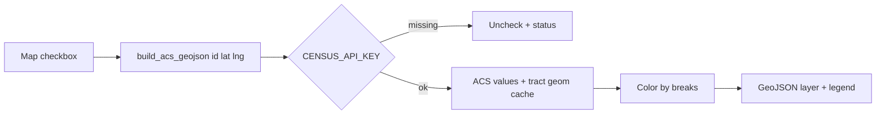

# ACS demographics Map overlays — Design Spec (Slice 1)

**Date:** 2026-07-18  
**Status:** Implemented 2026-07-18  
**Product:** Homebuy Map tab  

## Problem

Map already has a strong ACS **median income** choropleth. Users want the same filled-tract treatment for:

1. Median home value  
2. Average number of kids (under 18 per household)  
3. Median age  

Zoning is **out of scope for this slice** (Slice 2 — city GIS).

## Goals

1. Three new Map layer toggles that render like Median income (tract GeoJSON + legend + status).  
2. Reuse Census ACS + TIGER geometry pipeline; require existing `CENSUS_API_KEY`.  
3. Refactor so income is one variable among several configs — not a third copy-paste module.  

## Non-goals

- Zoning / land-use overlays (Slice 2).  
- Redfin sale-price choropleth.  
- Flood / crime / Street View changes beyond wiring new checkboxes.  
- Nationwide preload; pin-local county fetch only (same as income).  

## Decisions (locked)

| Decision | Choice |
|----------|--------|
| Scope | ACS trio only; zoning later |
| Kids metric | Approx. **children under 18 per occupied household** = `B09001_001E` ÷ `B25003_001E` |
| Home value | ACS `B25077` owner-estimated median value (not sale price) — per [`docs/RESEARCH.md`](../../RESEARCH.md) |
| Median age | ACS `B01002_001E` |
| UX | Separate checkboxes (not a single dropdown) |
| Geometry | Same tract polygons + pin bbox as income |
| Key | `CENSUS_API_KEY` (already required for income) |

## Variables

| Layer id | Toggle label | ACS inputs | Unit | Notes |
|----------|--------------|------------|------|--------|
| `income` | Median income (ACS) | `B19013_001E` | USD | Existing; becomes a config |
| `home_value` | Median home value (ACS) | `B25077_001E` | USD | Owner estimate |
| `median_age` | Median age (ACS) | `B01002_001E` | years | |
| `avg_kids` | Avg kids / HH (ACS) | `B09001_001E` / `B25003_001E` | kids/HH | Skip tract if denominator ≤ 0 or either missing |

ACS 5-year defaults stay on the existing year constant in `census_acs.py` (currently 2023) unless a single shared bump is needed.

### Color / legend (cyberpunk, distinguishable)

Exact breakpoints can be tuned in implementation; must ship with legends:

- **Home value ($):** bands e.g. &lt;$400k · $400–600k · $600–800k · $800k–1M · $1–1.5M · $1.5M+ (CA-biased; tunable).  
- **Median age:** e.g. &lt;30 · 30–35 · 35–40 · 40–45 · 45–50 · 50+.  
- **Avg kids/HH:** e.g. &lt;0.3 · 0.3–0.6 · 0.6–0.9 · 0.9–1.2 · 1.2+.  

Income palette stays as today. New layers use related but distinct ramps so stacked toggles remain readable.

## Architecture

```text
ACS_LAYERS[id] → get/get_variable(table vars) → GEOID→value
               → same TIGER tract features near pin
               → FeatureCollection { fillColor, popup, value }
               → map_view checkbox → geoJSON + legend
```



### Refactor target

Prefer evolving [`app/core/census_acs.py`](../../../app/core/census_acs.py) (or extract `app/core/acs_choropleth.py` if file gets unwieldy):

**Shared (keep / generalize):**

- `CensusKeyMissing`, `census_api_key`, `has_census_key`  
- `bbox_around`, FCC FIPS, county tract geometry fetch + cache  
- GeoJSON assembly with `fillColor` / `popup` / style contract used by Map  

**Per-layer config (dataclass or dict):**

- `id`, `label`, `legend`, `breaks`  
- `acs_get_vars: list[str]` (one or more columns)  
- `parse(rows) → dict[geoid, float | None]`  
- `format_popup(value) → str`  
- `format_status(n_tracts, meta) → str`  

**Public API:**

```python
def build_acs_geojson(layer_id: str, lat: float, lng: float) -> dict: ...
```

Keep **compat wrappers** so existing imports don’t break mid-refactor:

```python
def build_income_geojson(lat, lng) -> dict:
    return build_acs_geojson("income", lat, lng)

INCOME_LEGEND = ACS_LAYERS["income"].legend
```

Cache keys must include `layer_id` + year + bbox/FIPS so layers don’t collide.

### Map UI — [`app/modules/map_view.py`](../../../app/modules/map_view.py)

Add checkboxes in the layer row (order suggestion):

1. Flood (FEMA)  
2. Median income (ACS)  
3. Median home value (ACS)  
4. Median age (ACS)  
5. Avg kids / HH (ACS)  
6. Crime near pin  

Each ACS toggle:

- Requires pin + `CENSUS_API_KEY` (same messages as income).  
- One GeoJSON layer in state (`income`, `home_value`, `median_age`, `avg_kids`).  
- Shared choropleth style helper already used for income/crime.  
- Legends stack in `legend_box` when multiple layers are on (same pattern as income + crime).  
- Status line on success, e.g. `Home value: 42 tracts near pin (ACS B25077, 2023)`.  
- Loading… during fetch; failures uncheck + notify.

Optional small cleanup: one generic `toggle_acs(layer_id)` to avoid four near-identical handlers — preferred if it stays readable.

## Testing

- Unit tests for each layer’s `parse` / fill-color breaks / kids division (zero HH → None).  
- Regression: existing income tests keep passing (or move to parameterized `layer_id="income"`).  
- No live Census required in CI (mock rows / fixtures).  
- Full `pytest -q` green.

## Docs

Update in the same turn as ship:

- `AGENTS.md` — overlays list + key files  
- `README.md` — Map toggle table  
- `docs/RESEARCH.md` / `docs/TODO.md` — home value no longer “deferred”; kids + age noted as shipped  

## Slice 2 (preview only — not this work)

**Zoning:** public city/county zoning WMS or GeoJSON for supported metros (start with places we already treat specially, e.g. LA County / Santa Monica if free endpoints exist). Separate design + city coverage matrix; not Census.

## Risks

| Risk | Mitigation |
|------|------------|
| Too many checkboxes | Acceptable for v1; collapse group later if needed |
| Kids metric misunderstood | Label “Avg kids / HH” + popup “children under 18 per occupied household (ACS)” |
| Home-value breaks wrong for non-CA | CA-first breaks; document tunable constants |
| Refactor breaks income | Compat wrappers + existing tests |

## Success criteria

- [ ] Three new toggles show filled tract choropleths near pin  
- [ ] Each has a legend; stacked when multiple on  
- [ ] Missing Census key / no pin behave like income  
- [ ] Income behavior unchanged for users  
- [ ] Zoning not implemented in this slice  
- [ ] `pytest -q` green; AGENTS + README updated  
