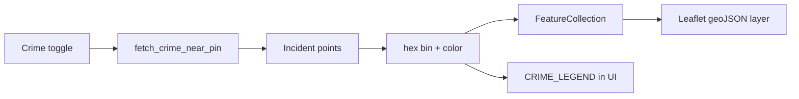

# Crime density choropleth — Design Spec

**Date:** 2026-07-18  
**Status:** Approved in conversation; pending file review  
**Product:** Homebuy Map tab  

## Problem

Crime near pin is rendered as up to 200 magenta `circleMarker` dots. That is hard to read compared to the Median income ACS choropleth (filled tracts by value). Users want a **similar filled display that represents frequency** instead of individual reports.

## Goals

1. Show crime **density** as filled polygons colored by incident count near the pin.
2. Match the income layer UX pattern: GeoJSON fill + legend + one status line.
3. Keep existing open-data sources, cities, cache, and Map toggles.

## Non-goals

- Flood restyle (FEMA NFHL is already a WMS zone layer, not report dots).
- New cities / nationwide crime / paid crime APIs.
- Individual incident dots in v1 (optional later “show reports”).
- Heatmap clouds or Leaflet.heat plugin.
- Changing income, flood, or Street View behavior.

## Decisions (locked)

| Decision | Choice |
|----------|--------|
| Scope | Crime only |
| Visual | Hex-grid choropleth (filled cells by count) |
| Sources | Unchanged: LA County (LAPD Socrata + Santa Monica CKAN) + Seattle Socrata |
| Bbox / window | Same pin bbox + ~365-day window as today’s fetch |
| Individual dots | Omitted in v1 |
| Flood | Out of scope |

## Architecture

```text
fetch_crime_near_pin(city, lat, lng)
  → points[]  (existing)
  → build_crime_density_geojson(points, pin, bbox)
  → FeatureCollection of hex polygons { count, fillColor, popup }
  → map_view toggle_crime: one geoJSON layer + CRIME_LEGEND
```



## Module: `app/core/crime_density.py`

New pure helper module (no network).

### Constants

- Hex cell size: ~0.004° (~400m) — tuned so zoom-14 neighborhoods are readable without a sea of tiny cells.
- Count breaks → fill colors (cyberpunk magenta scale, denser = hotter):

| Count | Color (example) |
|-------|-----------------|
| 1–2 | `#4A148C` (deep purple) |
| 3–5 | `#9C27B0` |
| 6–10 | `#FF2BD6` (magenta) |
| 11–20 | `#FF80AB` |
| 21+ | `#B8FF3C` (lime hot-spot) |

- `CRIME_LEGEND: list[tuple[str, str]]` for UI (same shape as `INCOME_LEGEND`).

### Functions

- `crime_fill_color(count: int) -> str`
- `hex_cell_polygon(q: int, r: int, size_deg: float) -> list[list[float]]` — exterior ring `[lng, lat]` for GeoJSON
- `bin_points_to_hex(points: list[dict], *, size_deg: float) -> dict[tuple[int,int], int]` — axial hex keys → counts
- `build_crime_density_geojson(points: list[dict], *, half_span_deg: float | None = None) -> dict`  
  - Input point shape: `{ "lat", "lng", ... }` (same as `fetch_crime_near_pin` points)  
  - Output:

```json
{
  "type": "FeatureCollection",
  "features": [
    {
      "type": "Feature",
      "properties": {
        "count": 12,
        "fillColor": "#FF80AB",
        "popup": "12 incidents (last 365 days)"
      },
      "geometry": { "type": "Polygon", "coordinates": [[[lng, lat], ...]] }
    }
  ],
  "meta": { "incidents": 87, "cells": 24, "days": 365 }
}
```

- Empty / invalid points: skipped. Zero-count cells: omit. No points → empty FeatureCollection with `meta.incidents = 0`.

### Hex algorithm

Use axial coordinates (q, r) with pointy-top or flat-top consistently. Convert lat/lng offsets from a local origin (min corner or pin) in degrees — acceptable approximation for ~few-mile bbox. Document that this is not equal-area global projection; good enough for neighborhood overlay.

## Integration: `fetch` + Map UI

### `app/core/crime_socrata.py`

- Keep `fetch_crime_near_pin` returning points + message (no breaking change for tests).
- Optional thin wrapper `fetch_crime_density_near_pin(...)` that calls fetch then `build_crime_density_geojson`, **or** Map module calls both in sequence. Prefer Map calling both for clearer separation (density stays pure).

### `app/modules/map_view.py`

When crime enabled and supported:

1. Fetch points via existing `fetch_crime_near_pin`.
2. Build density GeoJSON via `build_crime_density_geojson`.
3. Add **one** `generic_layer(name="geoJSON", ...)` like income.
4. Apply same fill style pattern as income (`setStyle` from `fillColor`, bind popup).
5. Render `CRIME_LEGEND` when crime is on (income legend stays when income is on; both legends may show if both toggles on — stack in `legend_box`).
6. Status: `Crime: {incidents} incidents in {cells} cells near pin` (or existing message when unsupported/failure).
7. Remove per-point `circleMarker` loop.

Loading / error / unsupported-city behavior unchanged (uncheck + status + notify).

## Testing

`tests/test_crime_density.py` (no live network):

- `crime_fill_color` break boundaries
- Empty points → empty features, meta zeros
- Cluster of points in one cell → single feature with correct count
- Spread points → multiple cells; total counts sum to incident count
- GeoJSON polygons closed rings; coordinates `[lng, lat]`

Existing `tests/test_map_overlays.py` crime city resolution stays as-is.

## Docs

After implementation: brief note in `AGENTS.md` / `README.md` that crime is a density hex choropleth (not dots). Update `docs/TODO.md` / RESEARCH “implemented” if they still say circle markers / cluster-heat only.

## Risks & mitigations

| Risk | Mitigation |
|------|------------|
| Hex math bugs | Unit tests with synthetic points |
| Cells too big/small | Constant `HEX_SIZE_DEG`; easy to tune |
| Overlap with income colors | Crime uses purple→magenta→lime; income uses blue→cyan→lime — both use lime at top; acceptable for v1; crime legend labels are counts not $ |
| Performance | Bin server-side; one GeoJSON layer vs 200 markers is cheaper |

## Success criteria

- [ ] Toggling Crime near pin shows filled hex cells, not magenta dots
- [ ] Legend explains count breaks
- [ ] Status reports incident + cell counts
- [ ] Unsupported cities / failures behave as today
- [ ] `pytest -q` green
- [ ] Flood and income overlays unchanged
