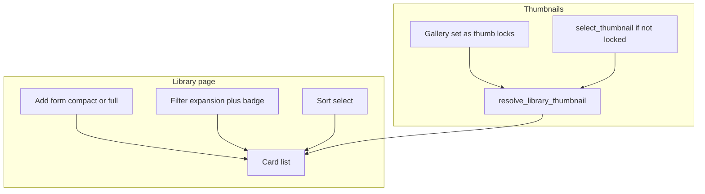

# Library iteration 2 — Design Spec

**Date:** 2026-07-18  
**Status:** Approved for planning  
**Product:** Homebuy library home page (`/`) + Photos gallery thumbnail control  

## Problem

Pass B made library cards readable (price accent, chips, collapsed filters, delete confirm), but the list still feels sparse and under-powered for research:

1. Cards waste horizontal space; photos stay secondary; always-on Zillow links add noise.
2. No sort, no active-filter signal, notes are invisible on the list, high HOA is easy to miss.
3. Auto thumbnails sometimes pick interiors; users cannot lock a better library photo.

## Goals

1. **Layout polish (A):** Denser, photo-stronger list cards; compact Add when the library is nonempty; quieter actions.
2. **Research UX (B):** Sort, active-filter badge, notes teaser, high-HOA highlight.
3. **Thumbnail quality (C):** Stronger exterior auto-pick **and** manual “use as library thumb” with lock so auto re-pick does not clobber the choice.

## Non-goals

- Grid / masonry redesign (remain a horizontal list).
- New filter dimensions (neighborhood, HOA range, city chips, etc.).
- Property detail header redesign.
- Gemini / Neighborhood / Financials / Map work.
- Paid vision APIs for room-type classification.

## Decisions (locked)

| Decision | Choice |
|----------|--------|
| Scope | A + B + C in one implementation plan |
| Layout | List only; taller left media strip (~180×135) |
| Add form | Compact single row when ≥1 home; full hint line when empty |
| Zillow / delete | Overflow menu (⋮): Open on Zillow, Delete…; whole card still opens property |
| Sort | Newest (default) \| Price ↑ \| Price ↓ |
| HOA highlight | Amber chip when `hoa_fee >= 400` |
| Notes teaser | One muted truncated line if `notes` nonempty |
| Thumb auto | Stronger interior penalties in `thumbnail.py`; re-run for unlocked homes |
| Thumb manual | Gallery per-photo control; sets `thumbnail_photo_id` + lock |
| Lock field | `thumbnail_locked: bool` default false; auto paths skip when true |
| Unlock | “Auto-pick again” clears lock and calls `select_thumbnail` |

## Architecture

```text
Library (/)
  → list_properties(search, price, beds, sort)
  → render cards (media | meta | overflow)
  → resolve_library_thumbnail(prop)  # honors locked / chosen id

Photos tab
  → set_library_thumbnail(property_id, photo_id)  # lock=True
  → clear_thumbnail_lock_and_autopick(property_id)  # lock=False + select_thumbnail

thumbnail.py
  → score_photo(...)  # stronger interior avoidance
  → pick_thumbnail_photo_id(...)
```



## A — Layout polish

### Card structure

| Zone | Behavior |
|------|----------|
| Media | Left strip ~180×135 (`object-fit: cover`); empty placeholder unchanged |
| Body | Address → price → primary chips → secondary/HOA chips → optional notes line |
| Actions | Top-right ⋮ menu: “Open on Zillow”, “Delete…” (existing confirm dialog) |
| Click | Card click → `/property/{id}`; menu items stop propagation |

CSS: update `.hb-library-thumb` size; ensure `.hb-library-card` uses a filled row (`justify-between` with body `flex-grow`, action column `flex-shrink: 0`) so the right side is not a dead band.

### Add form

- If filtered/unfiltered list has **zero homes in DB**: keep subtitle hint + Add card as today.
- If DB has **≥1 home**: omit the long helper sentence; keep a single dense URL + Add row (still a card).

Count label (“N homes”) remains for the **filtered** result set.

## B — Research UX

### Sort

Extend `PropertyService.list_properties` with `sort: str = "newest"`:

| Value | Order |
|-------|--------|
| `newest` | `created_at` desc (current default) |
| `price_asc` | `list_price` asc, nulls last |
| `price_desc` | `list_price` desc, nulls last |

UI: `ui.select` beside / above the Filter expansion (not buried inside it). Changing sort refreshes immediately.

Filtering remains client-side as today (load then filter); apply sort after filter in Python for consistency with null prices.

### Active filter badge

When any of search / min price / max price / min beds is nonempty after parse, show a caption or badge on the Filter expansion header (e.g. “2 active”). Clear resets badge to none.

### Notes teaser

If `prop.notes.strip()`: one `text-caption text-grey-6` line, truncated (~100 chars + ellipsis). No empty placeholder.

### HOA highlight

Threshold constant `HOA_HIGH_MONTHLY = 400` in `pages.py` (or a tiny constant near library helpers).

- `hoa_fee >= 400` → chip classes include amber highlight (new `.hb-meta-chip--hoa-high` using `--hb-amber`).
- Below threshold or missing → existing quiet secondary chip styling.

## C — Thumbnail quality

### Model / migrate

Add `Property.thumbnail_locked: bool` default `False` via SQLite `ALTER TABLE` in `_migrate_sqlite` (same pattern as other columns).

### Auto-pick improvements (`thumbnail.py`)

Add **interior / room** avoid keywords (examples: kitchen, bathroom, bedroom, living, closet, laundry, pantry, ceiling, island, granite) with strong negative scores (similar magnitude to current floorplan avoid).

Keep existing exterior keyword boosts, landscape aspect, sky-top blueish cue, white-diagram penalty.

Optional light indoor cue: if top band is not blueish **and** mean warmth is high **and** aspect is not strongly landscape, apply a modest penalty — keep it cheap and documented in tests; do not require ML.

Re-run auto selection for properties where `thumbnail_locked` is false (startup backfill already iterates missing thumbs; extend or call after scoring changes so unlocked homes re-score once — prefer an explicit `reselect_unlocked_thumbnails()` used from migrate/backfill, not on every page load).

### Manual override (gallery)

In `app/modules/gallery.py`, each tile gets a small flat icon button (e.g. `photo_library` / `push_pin`) with tooltip “Use as library thumbnail”.

- Calls new `PropertyService.set_library_thumbnail(property_id, photo_id)`:
  - Validates photo belongs to property
  - Sets `thumbnail_photo_id`, `thumbnail_locked = True`
  - Commits
- Visual: current library thumb tile shows a subtle cyan border or badge “Library thumb”.
- Control near status or on the current thumb: **Auto-pick again** → `unlock_and_select_thumbnail(property_id)` clears lock and runs `select_thumbnail`.

Re-import photos: if locked, keep `thumbnail_photo_id` when that photo still exists; if the locked photo was removed by replace-import, clear lock and auto-pick.

### Service API (concrete)

| Method | Behavior |
|--------|----------|
| `select_thumbnail(property_id)` | No-op if locked; else pick + set id, leave locked false |
| `set_library_thumbnail(property_id, photo_id)` | Set id + locked true |
| `unlock_and_select_thumbnail(property_id)` | locked false → `select_thumbnail` |
| `resolve_library_thumbnail(prop)` | Unchanged resolve-by-id with sensible fallback |

## Testing

- Unit: new interior keywords / scores in `tests/test_thumbnail.py`.
- Unit or service: lock prevents `select_thumbnail` overwrite; unlock re-picks.
- Manual: library visual (density, sort, badge, HOA amber, notes line); gallery set-thumb updates library card after navigate home.

## Docs

Update `AGENTS.md` (What’s done, product decision for thumb lock) and `README.md` (library sort / set library thumb) when shipping.

## Success criteria

1. Nonempty library: Add is one compact row; cards feel filled; Zillow not always visible.
2. Sort and filter badge work; notes and high HOA visible at a glance.
3. Manual thumb sticks across re-import (when photo survives) and auto backfill; Auto-pick again restores heuristic.
4. `pytest -q` green; app restart shows updated `/`.
