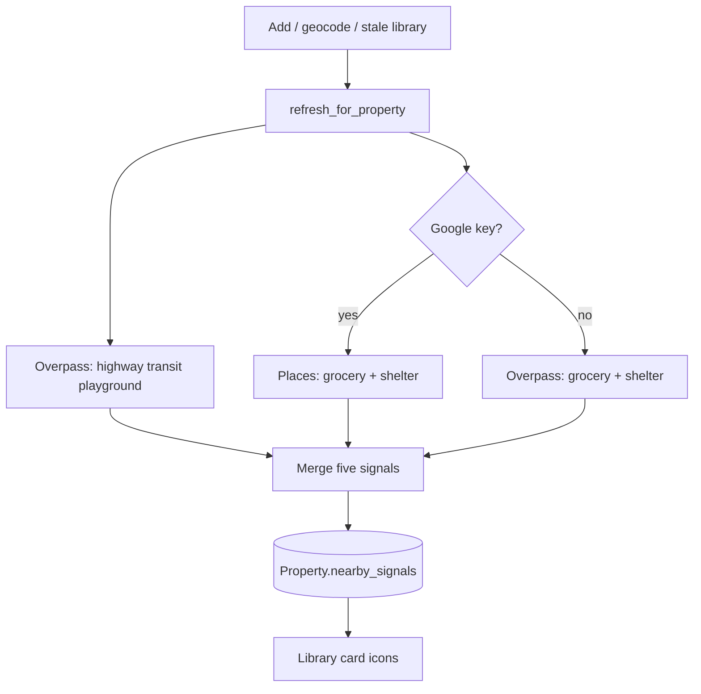

# Library nearby icons — Design Spec

**Date:** 2026-07-18  
**Status:** Approved (awaiting implementation plan)  
**Product:** Homebuy library cards  

## Problem

When scanning the library, homes look similar beyond price and beds. Buyers want **at-a-glance proximity signals** (highway risk, transit, playground, grocery, shelter/recovery) without opening each property or the Map tab.

## Goals

1. Show up to five **conditional icons** on the bottom-left of each library card thumbnail when the home meets distance criteria.
2. Persist results per property so the library stays fast (no live Overpass/Places on every render).
3. Explain each icon on hover (distance + nearest match name).
4. Work keyless via OSM; upgrade grocery/shelter accuracy when `GOOGLE_MAPS_API_KEY` is set.

## Non-goals (v1)

- Map markers or a property-page “Nearby” panel  
- Manual “Refresh nearby” control  
- Bus stops, generic parks (vs playgrounds), convenience-only stores, soup kitchens  
- Library filters driven by these signals (“hide near highway”)  
- Paid Places-only mode with no OSM fallback  

## Decisions (locked)

| Decision | Choice |
|----------|--------|
| Scope | Library cards only |
| Architecture | Cached JSON on `Property` (Approach 1) |
| Highways / transit / playground | OSM Overpass |
| Grocery / shelter | Google Places if key, else OSM |
| No Google key | OSM fallback for grocery + shelter (all five still work) |
| Transit | Metro/subway **or** light rail/tram — not buses |
| Highway | `motorway` + `motorway_link` only |
| Shelter matching | Strict tags/types; tooltip shows what matched |
| Tooltips | All five icons: distance + nearest name |
| Compute | On add + post-geocode; stale refresh (~30d) on library load |
| Icon UI | Soft neo chips overlaid on thumbnail bottom-left |

## Signal definitions

| Key | Icon (Material) | Color | Radius | Match |
|-----|-----------------|-------|--------|-------|
| `highway` | `directions_car` | Red / magenta risk | **800 ft** | OSM `highway=motorway` + `motorway_link` |
| `transit` | `train` | Green / lime | **0.5 mi** | OSM subway **or** light_rail / tram stop/station |
| `playground` | `park` | Green / lime | **0.5 mi** | OSM `leisure=playground` only |
| `grocery` | `local_grocery_store` | Green / lime | **0.5 mi** | Google supermarket/grocery if key; else OSM supermarket/grocery (exclude pure convenience when tags allow) |
| `shelter` | `health_and_safety` | Red / magenta risk | **0.25 mi** | Homeless shelter, transitional housing, addiction/rehab only |

Distances use haversine (same pattern as `schools_nces.py`). Highway distance is point-to-way approximated via Overpass geometry / nearest vertex.

## Data model

New columns on `Property` (SQLite `ALTER` via `_migrate_sqlite`):

- `nearby_signals` — JSON text (nullable)
- `nearby_signals_at` — ISO timestamp string (nullable)

### Cached payload

```json
{
  "highway": {"hit": true, "distance_ft": 420, "name": "I-10"},
  "transit": {"hit": true, "distance_mi": 0.31, "name": "Expo/Bundy Station"},
  "playground": {"hit": false},
  "grocery": {"hit": true, "distance_mi": 0.22, "name": "Trader Joe's"},
  "shelter": {"hit": true, "distance_mi": 0.18, "name": "Hope Center"}
}
```

Rules:

- Only keys with `"hit": true` render as icons.
- Misses may omit distance/name or set `"hit": false`.
- Per-key optional `"error": "..."` on fetch failure for that signal; still `"hit": false`.
- Highway reports `distance_ft`; others report `distance_mi`.

## Architecture

```text
PropertyService.add / post-geocode / library stale check
  → nearby_signals.refresh_for_property(prop)
       → Overpass (highway, transit, playground [, grocery, shelter if no Google])
       → Google Places (grocery, shelter) when GOOGLE_MAPS_API_KEY set
       → write Property.nearby_signals + nearby_signals_at
  → library card reads cache only → neo icon chips + tooltips
```



### Module: `app/core/nearby_signals.py`

- Pure-ish core: query helpers, distance thresholds, payload build/parse.
- File cache for raw Overpass/Places responses under `data/cache/nearby/` (~7 days), via existing `overlay_cache` helpers where practical.
- Property-level JSON freshness: recompute when `nearby_signals_at` missing or older than **~30 days**.

### Integration points

| Area | Change |
|------|--------|
| `app/core/models.py` + `db.py` | New columns + migrate |
| `app/core/property_service.py` | Call refresh after add/geocode; library stale pass (~30d, concurrency-capped) |
| `app/ui/pages.py` | Render icon row on `.hb-library-thumb-wrap` |
| `app/ui/theme.py` | `.hb-nearby-icons`, chip + risk/amenity color classes |
| Tests | Fixture Overpass/Places JSON; radius/threshold/parse/render helpers |

## Library card UI

- Position: **bottom-left overlay** on the thumbnail (`hb-library-thumb-wrap`), above the photo.
- Style: **soft neo chips** — small rounded dark-glass squares with Material icons; red/magenta for risk (`highway`, `shelter`); lime/green for amenities (`transit`, `playground`, `grocery`).
- Order (left → right when present): highway, transit, playground, grocery, shelter.
- Tooltip (`title` or Quasar tooltip): e.g. `0.31 mi · Expo/Bundy Station`; highway uses feet (`420 ft · I-10`).
- Empty thumb (no photo): still allow icons on the empty thumb wrap if signals exist.
- Clicks on icons must not steal the card navigation (or use non-interactive decorative chips with native `title`).

## Compute lifecycle

1. **Add / post-geocode** — once lat/lng exist, refresh signals. Failure must not fail add-home.
2. **Library load stale pass** — for properties with pin and missing/stale `nearby_signals_at` (> ~30 days), refresh with a small concurrency cap (avoid Overpass stampede).
3. **No pin** — skip; no icons until geocoded.
4. **Partial failure** — save successful keys; failed keys `hit: false` (+ optional `error`).
5. **Manual refresh** — out of scope v1.

## Error handling

- Network/timeout/HTTP errors are per-signal; never raise out of add/geocode path.
- Missing Google key is not an error — OSM used for grocery/shelter.
- No always-on library banner about keys or OSM attribution (document in README/AGENTS only).

## Testing

- Unit: haversine thresholds (800 ft, 0.5 mi, 0.25 mi); payload parse; hit filtering.
- Fixture-based Overpass + Places responses (no live network in CI).
- Manual: LA pin near freeway + Metro rail; confirm icons + tooltips on library card.

## Attribution / ToS notes

- OSM data: Overpass; follow fair-use (bbox around pin, cache responses).
- Google Places: only when user already has `GOOGLE_MAPS_API_KEY`; respect Places API terms; cache results.
- Do not scrape Zillow for these signals.

## Open follow-ups (post-v1)

- Property Nearby list + Map markers  
- Manual refresh  
- Library filters by signal  
- Broader park / bus options if user wants them later  
