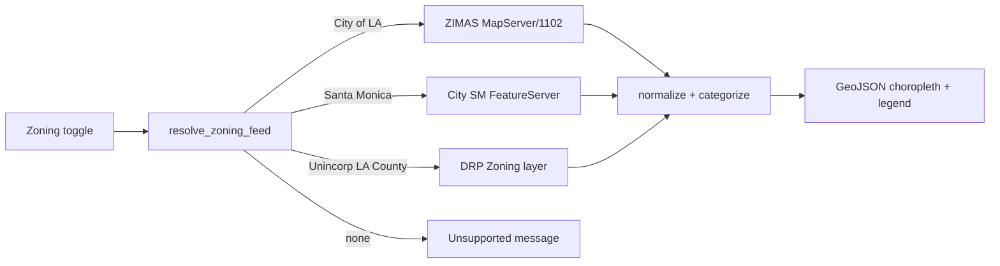

# Zoning Map overlay — Design Spec (Slice 2)

**Date:** 2026-07-18  
**Status:** Implemented 2026-07-18  

**Implementation notes:** City of LA uses ZIMAS MapServer **1101** (1102 spatial queries returned empty). Santa Monica uses **SCAG** `Zoning_poly_LA` in WGS84 because the city AGOL FeatureServer needs native State Plane for intersects.
**Product:** Homebuy Map tab  

## Problem

Homebuy’s Map tab has Census ACS tract choropleths (filled polygons + legend + popup). Buyers also need **zoning** context (e.g. R1 vs commercial). Zoning is **city/county GIS**, not Census. Prior research deferred zoning; this slice ships it in the same visual style as ACS layers.

## Goals

1. One **Zoning** Map toggle that renders **filled zoning polygons near the pin**, colored by high-level category, with click popups (zone code + description).  
2. Match ACS visual language (not FEMA-style WMS tiles, not a single pin-identify).  
3. Cover places you actually research first: **City of Los Angeles**, **Santa Monica**, and **unincorporated LA County**. Elsewhere: clear “not available” state.  
4. No API keys; server-side cache under `data/cache/`.

## Non-goals

- Nationwide / Seattle / arbitrary US cities (later).  
- Full zoning ordinance text or permitted-use matrices.  
- Parcel ownership, APN enrichment, or ZIMAS case history.  
- Changing ACS / flood / crime / Street View behavior beyond adding the toggle.

## Decisions (locked)

| Decision | Choice |
|----------|--------|
| Visual | GeoJSON polygons near pin + category colors + legend + popup (ACS-like) |
| Not | WMS-only tiles; zone-under-pin-only |
| Coverage v1 | City of LA + Santa Monica + LA County unincorporated |
| Unsupported | Disable or uncheck with status message (same pattern as crime) |
| Keys | None |

## Why multi-source

LA County DRP “Zoning” layers cover **unincorporated** county land. Most Westside pins sit in **City of LA** or **Santa Monica**, which publish separate services. A County-only layer would look empty on Santa Monica homes.

## Architecture

```text
toggle Zoning
  → resolve feed(s) from pin (city + lat/lng bbox heuristics)
  → ArcGIS REST query → GeoJSON (bbox, outSR=4326, limit)
  → normalize features { zone_code, zone_label, category, fillColor, popup, source }
  → one Leaflet geoJSON layer + ZONING_LEGEND
```



## Data sources (endpoints)

Exact layer IDs / field names must be verified during implementation (services move). Intended sources:

| Feed id | Jurisdiction | Intended service | Key fields (typical) |
|---------|--------------|------------------|----------------------|
| `la_city` | City of Los Angeles | `https://zimas.lacity.org/arcgis/rest/services/zma/zimas/MapServer/1102` | `ZONE_CMPLT`, `ZONE_CLASS` |
| `santa_monica` | City of Santa Monica | City GIS / Open Data FeatureServer (confirm Hub REST URL in implement) | zone code + description fields TBD |
| `la_county` | Unincorporated LA County | `https://arcgis.gis.lacounty.gov/arcgis/rest/services/DRP/GISNET_Public/MapServer/346` (or Open_Data Zoning `/3`) | `ZONE`, `Z_DESC`, `Z_CATEGORY` |

**Query pattern** (all): ArcGIS `query` with  
`geometry` = pin bbox (envelope, WGS84), `geometryType=esriGeometryEnvelope`, `inSR=4326`, `spatialRel=esriSpatialRelIntersects`, `outFields` subset, `returnGeometry=true`, `outSR=4326`, `f=geojson`, `resultRecordCount` capped (e.g. 200–500).

**Cache:** `overlay_cache` key = `zoning` + feed id + rounded bbox + layer revision tag. TTL ~24h (zoning changes slowly).

### Feed resolution

Order / rules (implement as pure helpers + unit tests):

1. If pin in **Santa Monica** city bbox / place name → `santa_monica`.  
2. Else if pin in **City of Los Angeles** (ZIMAS coverage / city name / known LA city bbox) → `la_city`.  
3. Else if pin in **LA County** mainland bbox → try `la_county` (unincorporated). Empty result → status “No zoning polygons returned for this pin (may be an incorporated city without a feed yet).”  
4. Else → unsupported.

Reuse / align heuristics with existing `crime_socrata` LA County bbox helpers where sensible; **do not** assume Crime city lists ≡ zoning feeds.

Optional later: try `la_city` then `la_county` if first returns zero features (city boundary edge cases).

## Visual / UX

### Category colors

Map detailed codes into a small category set for ACS-like legends:

| Category | Color (cyberpunk) | Heuristic (examples) |
|----------|-------------------|----------------------|
| Residential | `#00E5FF` | R, RD, RS, RE, RW, RU, A1/A2 agri-residential when clearly housing; starts with `R` |
| Commercial | `#FF2BD6` | C, CR, CM, CQ |
| Industrial | `#FFC107` | M, MR, manufacturing |
| Mixed / Public / Other | `#B8FF3C` / `#8B96A8` | PF, OS, mixed, unknown |

Exact prefix rules live in `categorize_zone(code, class_or_desc) -> category`. Prefer known city class fields (`ZONE_CLASS`, `Z_CATEGORY`) when present.

### Legend

`ZONING_LEGEND: list[tuple[str, str]]` — title **“Zoning (near pin)”**.

### Popup

```text
{zone_code}
{description or class}
Source: {feed label}
```

### Map UI ([`app/modules/map_view.py`](../../../app/modules/map_view.py))

- Checkbox: **Zoning** (place after Flood or before Crime; not buried in ACS demography list).  
- Layer state like flood/crime: single geoJSON layer, shared choropleth style helper.  
- Stack legend when on (alongside ACS/crime legends).  
- Status: `Zoning: N polygons (City of Los Angeles · ZIMAS)` or loading / error / unsupported.  
- Needs map pin (same as other overlays).

## Module: `app/core/zoning_gis.py`

Pure-ish client (network + cache):

- `zoning_supported(city, lat, lng) -> bool`  
- `resolve_zoning_feed(city, lat, lng) -> ZoningFeed | None`  
- `categorize_zone(...) -> str`  
- `build_zoning_geojson(city, lat, lng, *, half_span_deg=...) -> dict`  
  - FeatureCollection with `fillColor`, `popup`, `zone_code`, `category`, `source`  
  - `meta`: `{ feed_id, feed_label, count, ... }`  
- `ZONING_LEGEND`, feed URL constants  

Keep thin; no NiceGUI imports.

## Testing

`tests/test_zoning_gis.py` (no live network required for unit parts):

- Categorize heuristics for sample LA / SM / County codes.  
- Feed resolution: Santa Monica pin → `santa_monica`; downtown LA → `la_city`; Antelope Valley unincorporated heuristic → `la_county`; Portland → None.  
- Normalize fixture GeoJSON → features with fillColor/popup.  
- Optional: one marked `@pytest.mark.network` smoke against ZIMAS if CI allows (default off).

Existing overlay tests unchanged.

## Docs

Update when shipping:

- `AGENTS.md` / `README.md` — Zoning toggle + coverage caveat (not countywide for every city).  
- `docs/RESEARCH.md` / `docs/TODO.md` — zoning no longer fully deferred.  

## Risks

| Risk | Mitigation |
|------|------------|
| Santa Monica FeatureServer URL obscure / renames | Confirm Hub item during implement; fail soft with clear status |
| City of LA vs County empty at edges | Status message; optional second-feed fallback later |
| Huge geometries / overload | Tight bbox (~same as crime or slightly larger), record count cap, simplify if needed |
| Category mis-color | Prefer official class fields; fallback to regex on code |
| ToS / load | Public REST, cache aggressively, small bbox only |

## Success criteria

- [ ] Zoning toggle shows ACS-like filled polygons near pin in City of LA and Santa Monica (and County unincorporated where data exists)  
- [ ] Legend + popups with zone codes  
- [ ] Unsupported cities behave like crime’s “no layer” path  
- [ ] `pytest -q` green  
- [ ] Flood / ACS / crime unchanged  

## Follow-ups (not this slice)

- More cities (Long Beach, Pasadena, Seattle).  
- Second-source fallback when primary returns 0 features.  
- Link out to ZIMAS / city zoning ordinance page for the pin.
